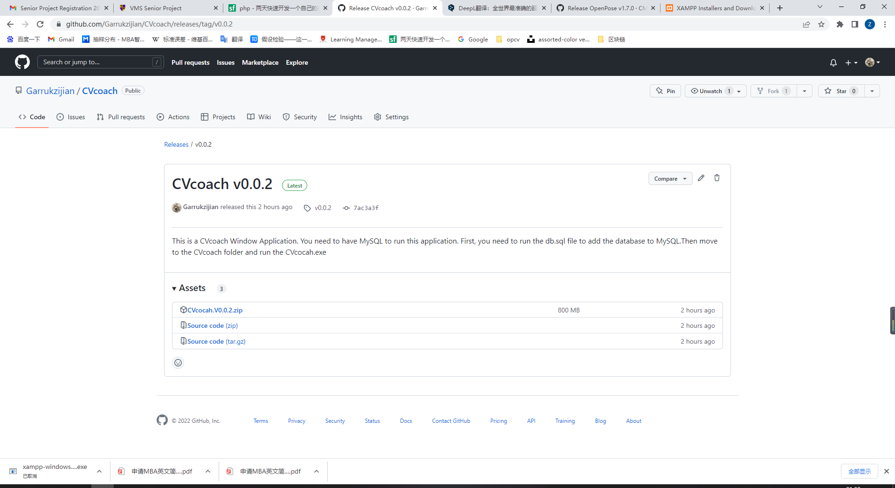
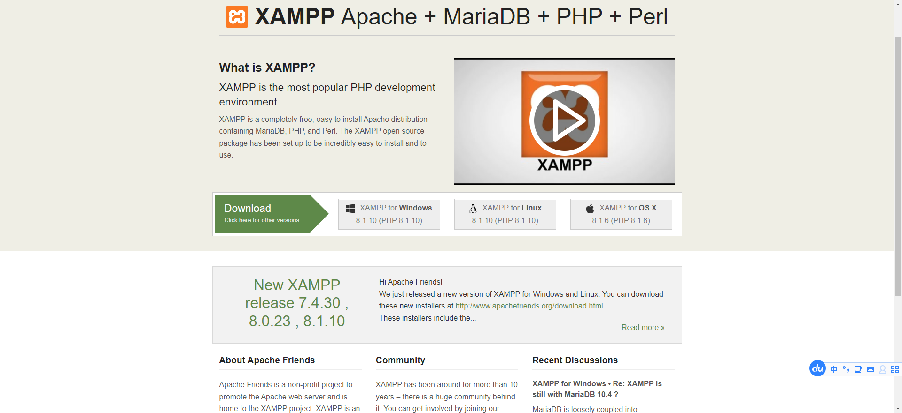
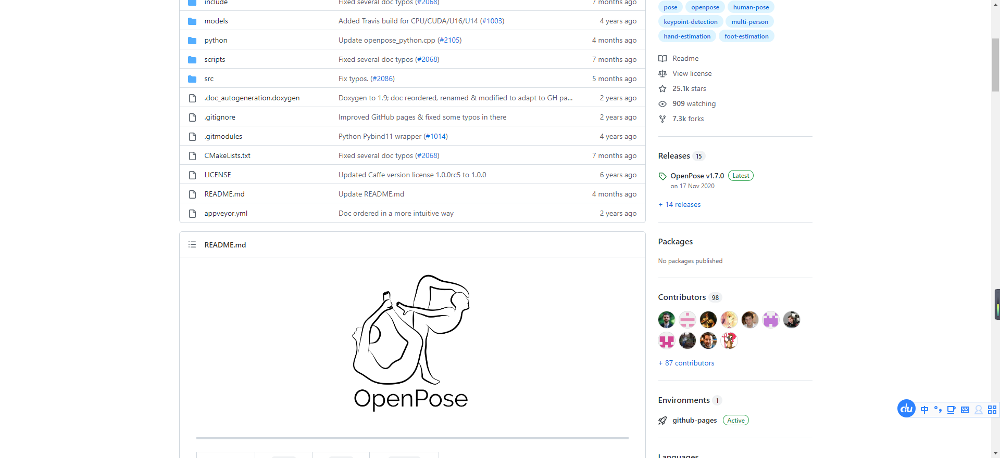
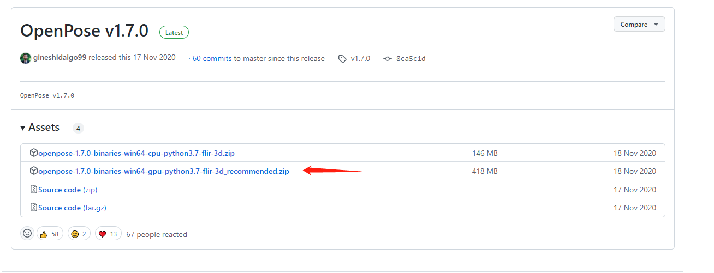

# CVcoach
This is a sports coaching project that pulls in the user's camera and performs human skeleton recognition through openpose and opencv. The project contains 4 kinds of sports and will give the user wrong and right judgments and also give coach advice during the sports.
# Quickly start
1.Download the v0.0.2 version we offer https://github.com/Garrukzijian/CVcoach/releases/tag/v0.0.2

2.Open your local MySQL (if you don't have MySQL on your computer, we recommend you to use XAMPP for MySQL deployment)https://www.apachefriends.org/

3.Run the database SQL file (db.sql)

4.Run CVcoach.exe in the download file CVcoach
# How to build it
The app is based on openpose for human keypoint detection, so you need to deploy openpose locally to start the app
Openpose:https://github.com/CMU-Perceptual-Computing-Lab/openpose

If you don't want to compile openpose locally you can also download the gpu-based openpose DEMO shown in the figure (this may have some requirements for your graphics card, if you have an older graphics card you can use the CPU computing version above)
https://github.com/CMU-Perceptual-Computing-Lab/openpose/releases/tag/v1.7.

## Important Warning
You need put this application in the Openpose python folder Otherwise, you may not be able to import openpose due to path problems 
